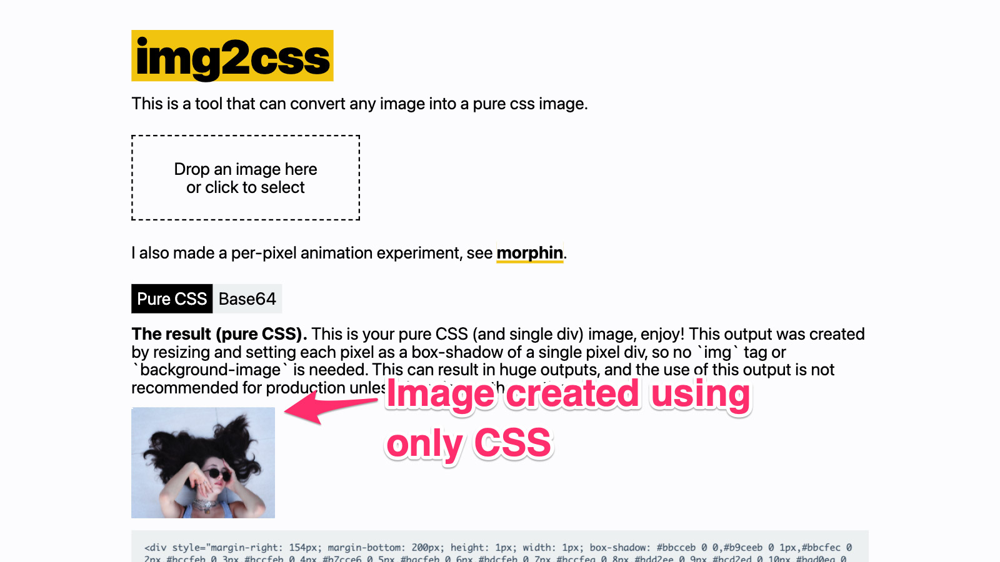

# [img2css](<(https://javier.xyz/img2css/)>)

Convert any image to pure CSS.

[](https://javier.xyz/img2css/)

- To use it go to https://javier.xyz/img2css
- Looking for a programmatic way to do this? See https://github.com/javierbyte/canvas-image-utils
- I also made a per-pixel animation experiment, see https://github.com/javierbyte/morphin

## How does it work?

It has two different outputs, pure css shadow matrix [1] and base64 embedded image [2].

- **Pure CSS**: This output was created by resizing and setting each pixel as a box-shadow of a single pixel div, so no `img` tag or `background-image` is needed. This can result in huge outputs, and the use of this output is not recommended for production unless there is no other option.
- **Base64**: The entire image file is embedded inside the `` tag using base64, so no need external hosting is needed.

### Development

Run development server:

```
npm run dev
```

Build

```
npm run build
```
